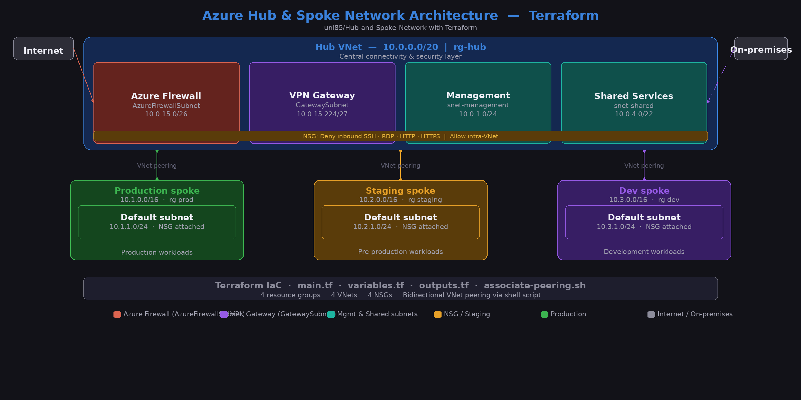

# Azure Hub and Spoke Network with Terraform

A professional-grade networking project deploying a **Hub and Spoke** architecture in Azure using Terraform (Infrastructure as Code). This project demonstrates secure network design, cross-VNet connectivity, and automated resource provisioning.



## Project Overview
This repository contains Terraform configuration files to deploy a secure, scalable network environment consisting of:
* **Hub Virtual Network:** A central management network hosting a Jumpbox (Bastion) VM.
* **Spoke Virtual Network:** An isolated workload network with a private backend VM.
* **VNet Peering:** High-speed, low-latency connection between the Hub and Spoke.
* **Security:** Network Security Groups (NSGs) configured to allow SSH access only to the Hub, keeping the Spoke completely private.

## Tech Stack
* **Cloud Provider:** Microsoft Azure
* **IaC Tool:** Terraform
* **Language:** HCL (HashiCorp Configuration Language)
* **Operating System:** Ubuntu 18.04 LTS

## Repository Structure
* `main.tf`: Defines the Azure provider, existing Resource Group data, and Virtual Networks with Peering.
* `network.tf`: Contains Subnets, Public IPs, Network Interfaces, NSG rules, and Virtual Machine definitions.
* `.gitignore`: Prevents sensitive `.tfstate` files and the `.terraform` folder from being uploaded.

## Getting Started

### Prerequisites
1.  [Terraform](https://www.terraform.io/downloads) installed locally.
2.  [Azure CLI](https://learn.microsoft.com/en-us/cli/azure/install-azure-cli) installed.
3.  An active Azure Subscription (Student Credits used here).

### Deployment Steps
1. Clone the repository:
   ```bash
   git clone [https://github.com/uni85/Hub-and-Spoke-Network-with-Terraform.git](https://github.com/uni85/Hub-and-Spoke-Network-with-Terraform.git)
   cd Hub-and-Spoke-Network-with-Terraform
